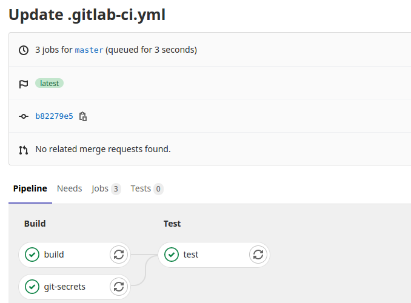
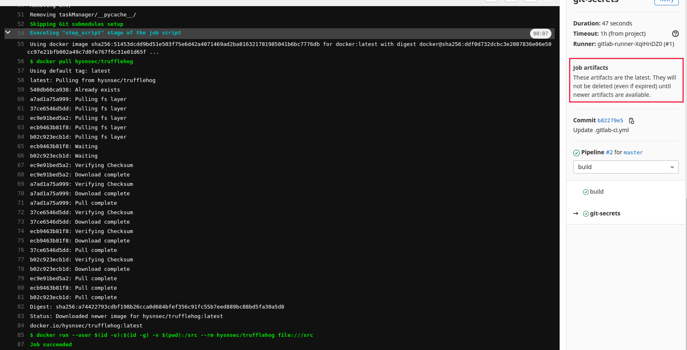
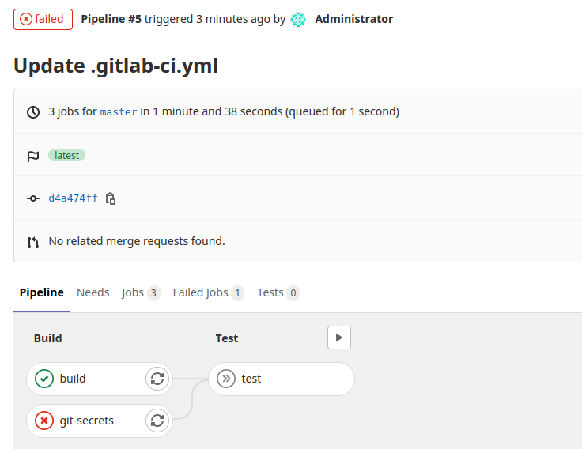
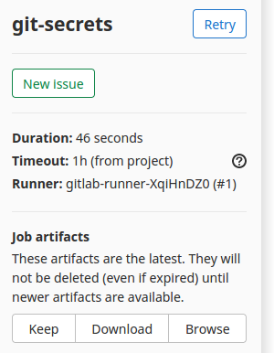
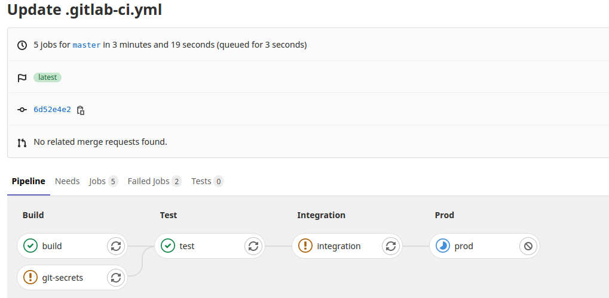

Learn how to embed the TruffleHog tool into CI/CD pipeline
================================================================

Use TruffleHog tool to perform secrets scanning in CI/CD pipeline
----------------------------------------------------------------

In this scenario, you will learn how to embed Secrets scanning in CI/CD pipeline.

You will learn to use TruffleHog in CI/CD pipeline and how to allow job failure when the tool found several issues.

A simple CI/CD pipeline
----------------------------------------------------------------

Considering your DevOps team created a simple CI pipeline with the following contents.

this example gitlab ci code
```
image: docker:latest

services:
  - docker:dind

stages:
  - build
  - test
  - release
  - preprod
  - integration
  - prod

build:
  stage: build
  image: python:3.6
  before_script:
   - pip3 install --upgrade virtualenv
  script:
   - virtualenv env
   - source env/bin/activate
   - pip install -r requirements.txt
   - python manage.py check

test:
  stage: test
  image: python:3.6
  before_script:
   - pip3 install --upgrade virtualenv
  script:
   - virtualenv env
   - source env/bin/activate
   - pip install -r requirements.txt
   - python manage.py test taskManager
```

We have two jobs in this pipeline, a **build** job and a **test** job. As a security engineer, I do not care what they are doing as part of these jobs. Why? Imagine having to learn every build/testing tool used by your DevOps team, it will be a nightmare. Instead, rely on the DevOps team for help.

Let’s log in to Gitlab using the following details.

- source code : django-nv

Next, we need to create a CI/CD pipeline by adding the above content to the **.gitlab-ci.yml** file. Click on the **Edit** button to start adding the content.

Save changes to the file using **Commit changes** button.

Verify the pipeline run
-------------

As soon as a change is made to the repository, the pipeline starts executing the jobs.

Exercise
-------------
Recall techniques you have learned in the previous module (Secure SDLC and CI/CD).

1. Read the [trufflehog documentation](https://github.com/dxa4481/truffleHog)
2. Embed git secrets scanning tool, Trufflehog in **build** stage with job name as **git-secrets**
3. Ensure the job is running in the **build** stage
4. You can either install truffleHog manually or use **hysnsec/trufflehog** docker container
5. Follow all the best practices while embedding Trufflehog in the CI/CD pipeline. Don’t forget the tool evaluation criteria
6. Can you figure out why Trufflehog didn’t give an output or file after scanning is done?

> Please try to do this exercise without looking at the solution on the next page.[skip]

Embed TruffleHog in CI/CD pipeline
--------------------------------

As discussed in the **Secrets Scanning** exercise, we can embed TruffleHog in our CI/CD pipeline. However, do remember you need to run the command manually before you embed this SAST tool in the pipeline.

copy this gitlab ci configuration to .gitlab-ci.yml

```
image: docker:latest

services:
  - docker:dind

stages:
  - build
  - test
  - release
  - preprod
  - integration
  - prod

build:
  stage: build
  image: python:3.6
  before_script:
   - pip3 install --upgrade virtualenv
  script:
   - virtualenv env
   - source env/bin/activate
   - pip install -r requirements.txt
   - python manage.py check

test:
  stage: test
  image: python:3.6
  before_script:
   - pip3 install --upgrade virtualenv
  script:
   - virtualenv env
   - source env/bin/activate
   - pip install -r requirements.txt
   - python manage.py test taskManager

git-secrets:
  stage: build
  script:
    - docker pull hysnsec/trufflehog
    - docker run --user $(id -u):$(id -g) -v $(pwd):/src --rm hysnsec/trufflehog file:///src
```

As discussed, any change to the repo kick starts the pipeline.

we can see the result of this pipeline by this picture:




> As you can see, Trufflehog didn’t give us any output as it did on the DevSecOps Box. Why?

Let’s try running the **git status** command after the Trufflehog command and see the job’s output.

```
git-secrets:
  stage: build
  script:
    - docker pull hysnsec/trufflehog
    - docker run --user $(id -u):$(id -g) -v $(pwd):/src --rm hysnsec/trufflehog file:///src
    - git status
```

Notice the last line of the above job, we have added **git status** command.

> HEAD detached at c4560d9
>
> nothing to commit, working tree clean

The output tells us that **HEAD is detached**; what does it mean? It means we’re not on a branch but checked out a specific commit in the history. **Trufflehog needs us to be on a branch**. Hence Trufflehog didn’t find any secrets, and we can fix it with the following jobs.

Copy text below

```
git-secrets:
  stage: build
  script:
    - apk add git
    - git checkout master
    - docker run -v $(pwd):/src --rm hysnsec/trufflehog file:///src --json | tee trufflehog-output.json
  artifacts:
    paths: [trufflehog-output.json]
    when: always  # What is this for?
    expire_in: one week
```
Picture pipeline failed but the job artifact created success




The **git** function helps us in cloning the source code and then checking out the **master** branch.

We do not want to fail the builds/jobs/scan in **DevSecOps Maturity Levels 1 and 2**, as security tools spit a significant amount of false positives.

You can use the **allow_failure** tag to not fail the build even though the tool found issues.

```
git-secrets:
  stage: build
  script:
    - apk add git
    - git checkout master
    - docker run -v $(pwd):/src --rm hysnsec/trufflehog file:///src --json | tee trufflehog-output.json
  artifacts:
    paths: [trufflehog-output.json]
    when: always  # What is this for?
    expire_in: one week
  allow_failure: true   #<--- allow the build to fail but don't mark it as such
```

> Why we’re adding apk add git?
> 
> See the first line in **.gitlab-ci.yml** file, the image keyword is the name of the Docker image the Docker executor runs to perform the CI tasks, and we use **docker:latest (Alpine-based)** image as default.

After adding the allow_failure tag, the pipeline would look like the following.

copy text below to full pipeline

```
image: docker:latest

services:
  - docker:dind

stages:
  - build
  - test
  - release
  - preprod
  - integration
  - prod

build:
  stage: build
  image: python:3.6
  before_script:
   - pip3 install --upgrade virtualenv
  script:
   - virtualenv env
   - source env/bin/activate
   - pip install -r requirements.txt
   - python manage.py check

test:
  stage: test
  image: python:3.6
  before_script:
   - pip3 install --upgrade virtualenv
  script:
   - virtualenv env
   - source env/bin/activate
   - pip install -r requirements.txt
   - python manage.py test taskManager

git-secrets:
  stage: build
  script:
    - apk add git
    - git checkout master
    - docker run -v $(pwd):/src --rm hysnsec/trufflehog file:///src --json | tee trufflehog-output.json
  artifacts:
    paths: [trufflehog-output.json]
    when: always  # What is this for?
    expire_in: one week
  allow_failure: true

integration:
  stage: integration
  script:
    - echo "This is an integration step"
    - exit 1
  allow_failure: true # Even if the job fails, continue to the next stages

prod:
  stage: prod
  script:
    - echo "This is a deploy step."
  when: manual # Continuous Delivery
```
You will notice that the **git-secrets** job failed however it didn’t block others from continuing further.



