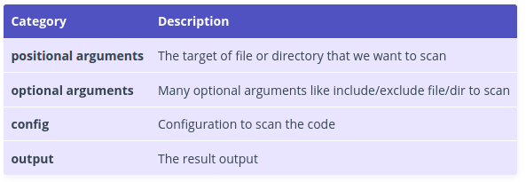

Static Analysis using Semgrep
================================================================

We will learn the basic usage of semgrep to perfom static analysis
----------------------------------------------------------------
In this scenario, you will learn basics of semgrep to perform static code analysis.

Download the source code
----------

We will do all the exercises locally first in DevSecOps-Box, so let’s start the exercise.

First, we need to download the source code of the project from our git repository

```
git clone https://gitlab.practical-devsecops.training/pdso/django.nv webapp

cd webapp
```

Install Semgrep
----------

> Semgrep is a fast, open-source, static analysis tool that excels at expressing code standards — without complicated queries — and surfacing bugs early in the development flow. Precise rules look like the code you’re searching; no more traversing abstract syntax trees or wrestling with regexes.
> 
>  You can find more details about the project at https://github.com/returntocorp/semgrep.


Let’s install the Semgrep tool on the system to perform static analysis.
```
pip3 install semgrep
```
We have successfully installed semgrep, let’s explore the functionality it provides us.

```
semgrep --help
```

Let’s move to the next step.

Basic usage of Semgrep
----------

The tool has four categories of parameters.


For example, we will scan the source code of webapp to see all the os.system calls in the program.
```
semgrep --lang python -e "os.system(...)" .
```
output
```
taskManager/misc.py
33:    os.system(
34:        "mv " +
35:        uploaded_file.temporary_file_path() +
36:        " " +
37:        "%s/%s" %
38:        (upload_dir_path,
39:         title))
ran 1 rules on 50 files: 1 findings
```

> --lang is the parameter to set which programming language that we want to scan.
>
> -e is the parameter to set the pattern for code search pattern, see the details [here](https://semgrep.dev/docs/writing-rules/pattern-syntax).
>
> webapp is a target directory where the source code is located.

And also, we can set the output result into a JSON file.

```
semgrep --lang python -e "os.system(...)" . --json | jq
```
output
```
ran 1 rules on 51 files: 1 findings
{
  "results": [
    {
      "check_id": "-",
      "path": "taskManager/misc.py",
      "start": {
        "line": 33,
        "col": 5
      },
      "end": {
        "line": 39,
        "col": 17
      },
      "extra": {
        "message": "os.system(...)",
        "metavars": {},
        "metadata": {},
        "severity": "ERROR",
        "is_ignored": false,
        "lines": "    os.system(\n        \"mv \" +\n        uploaded_file.temporary_file_path() +\n        \" \" +\n        \"%s/%s\" %\n        (upload_dir
_path,\n         title))"
      }
    }
  ],
  "errors": []
}
```
We can specify a file or directory that we want to scan by providing –include argument.

```
semgrep --lang python -e "DEBUG =True" --include settings.py .
```
output
```
taskManager/settings.py
28:DEBUG = True
ran 1 rules on 1 files: 1 findings
```

The above command will perform a scan on `settings.py` file, to see if DEBUG=True is being used in the `settings.py` file.

Exercise
----------

1. Scan all declarations of variables in webapp source code
2. Next, scan all function calls that have request as an argument

